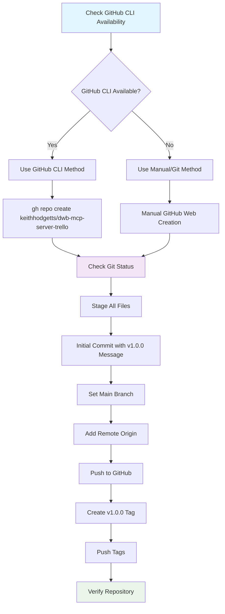

# 🚀 GitHub Deployment Plan - DWB Trello MCP Server

## 📋 Project Overview

**Repository:** `keithhodgetts/dwb-mcp-server-trello`  
**Version:** v1.0.0  
**Objective:** Push complete MCP server codebase to GitHub with proper versioning and remote setup

## 🔍 Current Project State Analysis

### ✅ What's Ready
- Git repository is already initialized locally
- Complete TypeScript MCP server with Trello integration
- Comprehensive documentation (README.md, deployment guides, etc.)
- Proper .gitignore configuration
- Package.json configured for `keithhodgetts/dwb-mcp-server-trello`
- Build system and deployment configurations ready

### 🎯 What Needs to be Done
- Check GitHub CLI availability
- Create GitHub repository
- Set up remote origin
- Push codebase to GitHub
- Tag the v1.0.0 release

## 📊 Implementation Flow



## 🔧 Detailed Implementation Steps

### Phase 1: Environment Check & Repository Creation

#### Step 1: Check GitHub CLI Availability
```bash
# Test GitHub CLI availability
which gh
gh --version
gh auth status
```

#### Step 2A: Create Repository (GitHub CLI Method)
```bash
# Create repository using GitHub CLI
gh repo create keithhodgetts/dwb-mcp-server-trello \
  --public \
  --description "A custom MCP server for Trello board automation and client onboarding" \
  --clone=false
```

#### Step 2B: Create Repository (Manual Method)
1. Navigate to [GitHub.com](https://github.com)
2. Click "+" → "New repository"
3. Repository name: `dwb-mcp-server-trello`
4. Description: "A custom MCP server for Trello board automation and client onboarding"
5. Set to **Public**
6. **DO NOT** initialize with README, .gitignore, or license
7. Click "Create repository"

### Phase 2: Git Configuration & Initial Push

#### Step 3: Prepare Local Repository
```bash
# Check current git status
git status

# Check if remote already exists
git remote -v

# Stage all files (if needed)
git add .
```

#### Step 4: Initial Commit & Push
```bash
# Create initial commit
git commit -m "Initial commit of DWB Trello MCP Server v1.0.0"

# Ensure main branch is set
git branch -M main

# Add remote origin (if not already added)
git remote add origin https://github.com/keithhodgetts/dwb-mcp-server-trello.git

# Push to GitHub
git push -u origin main
```

### Phase 3: Release Tagging & Verification

#### Step 5: Version Tagging
```bash
# Create annotated tag for v1.0.0
git tag -a v1.0.0 -m "Release v1.0.0: Initial release of DWB Trello MCP Server"

# Push tags to remote
git push origin --tags
```

#### Step 6: Repository Verification
- [ ] Confirm all files are uploaded correctly
- [ ] Verify README.md displays properly on GitHub
- [ ] Check that deployment configurations are present in `/deployment` folder
- [ ] Ensure package.json repository links are correct
- [ ] Verify .gitignore is working (no .env files, build artifacts, etc.)

### Phase 4: Post-Setup Validation

#### Step 7: Final Checks
```bash
# Test clone functionality
cd /tmp
git clone https://github.com/keithhodgetts/dwb-mcp-server-trello.git test-clone
cd test-clone
ls -la
cd - && rm -rf test-clone
```

## 🔒 Security Considerations

### Files Excluded from Repository
- `.env` - Local environment variables
- `.env.local` - Local development overrides
- `.env.production` - Production secrets
- `build/` - Compiled JavaScript output
- `node_modules/` - Dependencies
- `.vscode/` - Editor configuration

### Files Included in Repository
- `.env.example` - Template for environment variables
- `.env.production.example` - Production template
- Source code in `src/`
- Documentation files
- Deployment configurations
- Package configuration files

## 📦 Repository Structure After Deployment

```
keithhodgetts/dwb-mcp-server-trello/
├── .github/                     # GitHub workflows (if added later)
├── deployment/                  # Cloud deployment configs
│   ├── fly.toml
│   ├── railway.toml
│   └── render.yaml
├── docs/                        # Additional documentation
├── src/                         # TypeScript source code
│   ├── index.ts
│   ├── trello-client.ts
│   ├── board-templates.ts
│   ├── types.ts
│   ├── validators.ts
│   └── rate-limiter.ts
├── templates/                   # Board templates
├── .env.example                 # Environment template
├── .env.production.example      # Production template
├── .gitignore                   # Git exclusions
├── package.json                 # Package configuration
├── tsconfig.json               # TypeScript config
├── README.md                   # Main documentation
├── LICENSE                     # MIT license
└── [other documentation files]
```

## 🎯 Expected Outcomes

After successful completion:

### ✅ GitHub Repository
- Repository `keithhodgetts/dwb-mcp-server-trello` created and accessible
- Complete codebase pushed to `main` branch
- Remote origin configured correctly
- Version tagged as `v1.0.0`

### ✅ Ready for Integration
- NPM package publishing (if desired)
- Docker deployment using provided Dockerfile
- Cloud platform deployment (Render, Railway, Fly.io)
- MCP client integration following `MCP_CLIENT_INTEGRATION.md`

### ✅ Documentation Available
- Comprehensive README with installation instructions
- Integration guides for MCP clients
- Deployment strategy documentation
- API documentation for all tools

## 🚨 Potential Issues & Solutions

### Issue: GitHub CLI Not Available
**Solution:** Use manual repository creation via GitHub web interface

### Issue: Remote Already Exists
**Solution:** 
```bash
git remote remove origin
git remote add origin https://github.com/keithhodgetts/dwb-mcp-server-trello.git
```

### Issue: Authentication Problems
**Solution:** 
- Ensure GitHub credentials are configured
- Use personal access token if needed
- Check SSH key setup

### Issue: Large File Warnings
**Solution:** 
- Verify .gitignore is working
- Remove any accidentally staged large files
- Use `git rm --cached` if needed

## 📞 Next Steps After Deployment

1. **MCP Client Integration** - Follow `MCP_CLIENT_INTEGRATION.md`
2. **Choose Deployment Platform** - Review `DEPLOYMENT_STRATEGY.md`
3. **Test with Real Credentials** - Update .env and test board creation
4. **Consider NPM Publishing** - Package is ready for npm registry
5. **Set up CI/CD** - Add GitHub Actions for automated testing/deployment

## 📚 Related Documentation

- [`README.md`](README.md) - Main project documentation
- [`MCP_CLIENT_INTEGRATION.md`](MCP_CLIENT_INTEGRATION.md) - Website integration guide
- [`DEPLOYMENT_STRATEGY.md`](DEPLOYMENT_STRATEGY.md) - Production deployment options
- [`GITHUB_SETUP.md`](GITHUB_SETUP.md) - Original setup notes

---

**Status:** Ready for Implementation  
**Estimated Time:** 10-15 minutes  
**Prerequisites:** Git initialized, GitHub account access  
**Risk Level:** Low (well-documented, reversible steps)