# 📋 PROJECT PLAN: Custom MCP Trello Agent for Client Board Automation

## 🎯 Project Overview

This project forks and extends the existing `mcp-server-trello` to create a custom MCP agent for client board automation. The agent will maintain full backward compatibility while adding three new tools specifically designed for client onboarding and board management automation.

**Base Repository**: [MCP-Mirror/delorenj_mcp-server-trello](https://github.com/MCP-Mirror/delorenj_mcp-server-trello)

## 🏗️ Architecture Overview

```mermaid
graph TB
    A[MCP Client] --> B[Custom Trello MCP Server]
    B --> C[Existing Tools]
    B --> D[New Custom Tools]
    
    C --> C1[get_cards_by_list_id]
    C --> C2[get_lists]
    C --> C3[add_card_to_list]
    C --> C4[update_card_details]
    C --> C5[archive_card]
    C --> C6[add_list_to_board]
    C --> C7[archive_list]
    C --> C8[get_my_cards]
    C --> C9[get_recent_activity]
    
    D --> D1[create_board]
    D --> D2[get_boards]
    D --> D3[add_member_to_board]
    
    B --> E[Trello API Client]
    E --> F[Rate Limiter]
    E --> G[Trello REST API]
    
    D1 --> H[Board Template Engine]
    H --> I[Default Lists Creation]
    I --> J[🟢 New Request]
    I --> K[📥 Queue]
    I --> L[🛠 In Progress]
    I --> M[🧐 Review]
    I --> N[✅ Completed]
```



## 📁 Project Structure

```
dwb-trello-mcp/
├── src/
│   ├── index.ts                 # Main MCP server with tool handlers
│   ├── trello-client.ts         # Extended Trello API client
│   ├── rate-limiter.ts          # Rate limiting implementation
│   ├── types.ts                 # TypeScript type definitions
│   ├── validators.ts            # Input validation functions
│   └── board-templates.ts       # Board template engine (NEW)
├── templates/
│   ├── default-board-lists.json # Standard list template
│   └── board-readme-template.md # Board description template
├── docs/
│   ├── README.md               # Main documentation
│   ├── API.md                  # API reference
│   └── SETUP.md                # Setup instructions
├── docker/
│   ├── Dockerfile              # Container configuration
│   └── docker-compose.yml      # Development environment
├── tests/
│   ├── unit/                   # Unit tests
│   └── integration/            # Integration tests
├── .env.example                # Environment configuration
├── package.json                # Dependencies and scripts
└── tsconfig.json              # TypeScript configuration
```

## 🔧 Implementation Plan

### Phase 1: Project Setup & Fork

#### 1.1 Repository Setup
- [x] Clone `mcp-server-trello` into current directory
- [ ] Update `package.json` with new name: `@dwb/mcp-server-trello`
- [ ] Install dependencies with `pnpm install`
- [ ] Verify existing functionality works

#### 1.2 Environment Configuration
Create `.env.example` with required keys:
```env
TRELLO_API_KEY=
TRELLO_TOKEN=
TRELLO_ORG_ID=  # New: Optional organization ID for board creation
```

### Phase 2: Core Extensions

#### 2.1 Extend Trello Client (`src/trello-client.ts`)
Add new methods:
- `createBoard(params)` - Create board with template
- `getBoards(organizationId?)` - List available boards
- `addMemberToBoard(boardId, email, permission)` - Add member with permissions

#### 2.2 Board Template Engine (`src/board-templates.ts`)
New file to handle:
- Loading template from `templates/default-board-lists.json`
- Emoji fallback logic for list names
- Board description setting with README content
- Template validation and error handling

#### 2.3 Type Definitions (`src/types.ts`)
Extend existing types with:
```typescript
interface TrelloBoard {
  id: string;
  name: string;
  desc: string;
  url: string;
  organization?: string;
}

interface BoardTemplate {
  template_name: string;
  lists: string[];
  fallback_lists: string[];
}

enum MemberPermission {
  NORMAL = 'normal',
  ADMIN = 'admin',
  OBSERVER = 'observer'
}
```

#### 2.4 Input Validation (`src/validators.ts`)
Add validation functions:
- `validateCreateBoardRequest(args)`
- `validateGetBoardsRequest(args)`
- `validateAddMemberRequest(args)`

### Phase 3: MCP Tool Integration

#### 3.1 Tool Definitions
Add three new tools to the MCP server:

**Tool 1: `create_board`**
```typescript
{
  name: 'create_board',
  description: 'Creates a new Trello board with standard client onboarding template',
  inputSchema: {
    type: 'object',
    properties: {
      name: { 
        type: 'string', 
        description: 'Board name' 
      },
      description: { 
        type: 'string', 
        description: 'Board description (optional, uses README template if not provided)' 
      },
      default_lists: { 
        type: 'boolean', 
        default: true, 
        description: 'Create default list template' 
      },
      organization_id: { 
        type: 'string', 
        description: 'Organization ID (optional, uses TRELLO_ORG_ID env var if not provided)' 
      }
    },
    required: ['name']
  }
}
```

**Tool 2: `get_boards`**
```typescript
{
  name: 'get_boards',
  description: 'Lists available Trello boards',
  inputSchema: {
    type: 'object',
    properties: {
      organization_id: { 
        type: 'string', 
        description: 'Filter by organization (optional)' 
      },
      limit: { 
        type: 'number', 
        description: 'Max boards to return (optional)' 
      }
    },
    required: []
  }
}
```

**Tool 3: `add_member_to_board`**
```typescript
{
  name: 'add_member_to_board',
  description: 'Adds a member to a board by email with specified permissions',
  inputSchema: {
    type: 'object',
    properties: {
      board_id: { 
        type: 'string', 
        description: 'Board ID' 
      },
      email: { 
        type: 'string', 
        description: 'Member email address' 
      },
      permission: { 
        type: 'string', 
        enum: ['normal', 'admin', 'observer'], 
        default: 'normal',
        description: 'Member permission level'
      }
    },
    required: ['board_id', 'email']
  }
}
```

#### 3.2 Tool Implementation Logic

**`create_board` Implementation Flow:**
1. Validate input parameters
2. Load board template from `templates/default-board-lists.json`
3. Create board via Trello API
4. Create lists with emoji names, fallback to plain names if rejected
5. Set board description using README template
6. Return complete board information

**Emoji Fallback Logic:**
```typescript
async createListWithFallback(boardId: string, listName: string, fallbackName: string) {
  try {
    return await this.createList(boardId, listName);
  } catch (error) {
    if (error.message.includes('emoji') || error.message.includes('character')) {
      return await this.createList(boardId, fallbackName);
    }
    throw error;
  }
}
```

### Phase 4: Testing & Documentation

#### 4.1 Testing Strategy
- **Unit Tests**: Test individual functions and validation
- **Integration Tests**: Test with real Trello API (using test board)
- **CLI Testing**: Verify tools appear in `npx @modelcontextprotocol/sdk list-tools`
- **Manual Testing**: Test each tool with sample payloads

#### 4.2 Documentation Updates
- Update main README with custom tools section
- Add setup instructions for new environment variables
- Include usage examples for each new tool
- Document board template structure

### Phase 5: Docker & Deployment

#### 5.1 Docker Configuration
Create `Dockerfile`:
```dockerfile
FROM node:18-alpine
WORKDIR /app
COPY package*.json ./
RUN npm ci --only=production
COPY build/ ./build/
COPY templates/ ./templates/
EXPOSE 3000
CMD ["node", "build/index.js"]
```

Create `docker-compose.yml` for development:
```yaml
version: '3.8'
services:
  trello-mcp:
    build: .
    environment:
      - TRELLO_API_KEY=${TRELLO_API_KEY}
      - TRELLO_TOKEN=${TRELLO_TOKEN}
      - TRELLO_ORG_ID=${TRELLO_ORG_ID}
    volumes:
      - ./templates:/app/templates
```

## 🔄 Tool Workflow Examples

### Client Onboarding Workflow


## 📋 Template Specifications

### Default Board Lists Template
File: `templates/default-board-lists.json`
```json
{
  "template_name": "default_client_board",
  "lists": [
    "🟢 New Request",
    "📥 Queue", 
    "🛠 In Progress",
    "🧐 Review",
    "✅ Completed"
  ],
  "fallback_lists": [
    "New Request",
    "Queue",
    "In Progress", 
    "Review",
    "Completed"
  ]
}
```

### Board Description Template
File: `templates/board-readme-template.md`
- Contains client onboarding instructions
- Explains board workflow and list purposes
- Describes automation features
- Provides usage guidelines

## 🎯 Success Criteria

### Functional Requirements
- ✅ All existing MCP tools remain fully functional
- ✅ Three new tools successfully integrated and working
- ✅ Board creation applies 5-list template structure automatically
- ✅ Emoji fallback logic works correctly
- ✅ Member addition with proper permissions
- ✅ Board listing and filtering functionality

### Technical Requirements
- ✅ Tools appear in MCP `list-tools` output
- ✅ Input validation prevents invalid API calls
- ✅ Rate limiting respects Trello API limits
- ✅ Error handling provides meaningful messages
- ✅ TypeScript compilation without errors
- ✅ Docker deployment works correctly

### Testing Requirements
- ✅ Unit tests pass for all new functionality
- ✅ Integration tests work with real Trello API
- ✅ CLI testing confirms tool availability
- ✅ Manual testing validates end-to-end workflows

## 🚀 Future Extensions

The architecture supports easy addition of:
- **Custom Board Templates**: Multiple templates based on project type
- **Automated Card Creation**: "Request Launcher" cards with checklists
- **Webhook Integration**: Real-time updates and notifications
- **Advanced Member Management**: Bulk operations, role changes
- **Board Analytics**: Usage statistics and reporting
- **Template Management**: CRUD operations for board templates

## 📚 Reference Links

- **MCP Toolkit**: https://github.com/modelcontextprotocol/mcp-toolkit
- **MCP SDK**: https://www.npmjs.com/package/@modelcontextprotocol/sdk
- **Trello API Boards**: https://developer.atlassian.com/cloud/trello/rest/api-group-boards/
- **Trello API Auth**: https://developer.atlassian.com/cloud/trello/guides/rest-api/authorization/

## 🔧 Development Commands

```bash
# Install dependencies
pnpm install

# Build project
pnpm run build

# Start development server
pnpm run dev

# Run tests
pnpm test

# List available MCP tools
npx @modelcontextprotocol/sdk list-tools

# Run MCP inspector
pnpm run inspector

# Docker build
docker build -t dwb-trello-mcp .

# Docker run
docker-compose up
```

---

**This plan provides a comprehensive roadmap for creating a robust, extensible MCP Trello agent that meets all specified requirements while maintaining backward compatibility and supporting future enhancements.**